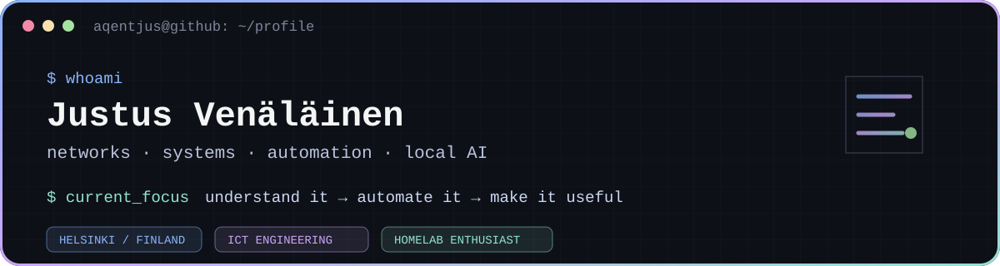

<div align="center">



<br />

[](https://www.linkedin.com/in/ju5tu5-venalainen/)
[](https://github.com/Aqentjus)
[](#)

</div>

## `> about`

I’m **Justus**, an ICT engineering student and compulsive tinkerer from Helsinki.

Most of what interests me lives somewhere between **networks, infrastructure, cybersecurity, automation, and local AI**. I like systems that I can understand end-to-end: build them, break them, inspect what happened, and then automate away the boring parts.

My GitHub is less of a polished product catalogue and more of a continuously evolving workshop — configs, utilities, experiments, infrastructure tooling, and whatever rabbit hole looked interesting that week.

```text
interests  = networking + security + systems + automation + AI
preferred  = practical > theoretical
habitat    = terminal / homelab / firewall CLI
philosophy = understand it → automate it → make it useful
```

## `> currently building`

- **Local AI assistants** — experimenting with tool use, long-term memory, local/cloud model routing, and useful personal automation.
- **Homelab infrastructure** — Proxmox, TrueNAS, Docker, n8n, Home Assistant, segmented networking, and the occasional unnecessary amount of firewalling.
- **Network & security tooling** — Palo Alto, Juniper, Cisco, DNS filtering, VPNs, and small scripts that make infrastructure less annoying.
- **Developer environment automation** — reproducible editor, terminal, and macOS/Linux setups instead of manually rebuilding the same machine twice.

## `> selected public projects`

| Project | What it is |
| --- | --- |
| **[AQENTJUS-EDL-PALO-ALTO](https://github.com/Aqentjus/AQENTJUS-EDL-PALO-ALTO)** | External Dynamic List tooling for domain blocking on Palo Alto firewalls and compatible DNS filtering setups. |
| **[aerospace-config](https://github.com/Aqentjus/aerospace-config)** | My macOS AeroSpace window-manager setup and workspace automation. |
| **[neovim-config](https://github.com/Aqentjus/neovim-config)** | An older stop on the never-ending journey toward the perfect editor setup. |
| **[Ohjelmointi](https://github.com/Aqentjus/Ohjelmointi)** | Programming exercises and experiments while studying software development. |

<sub>Some of the projects I spend the most time on are private, so the public repos only show part of the workshop.</sub>

## `> toolkit`

**Infrastructure & networking**  
`Palo Alto` · `Juniper` · `Cisco` · `Ubiquiti` · `Proxmox` · `TrueNAS` · `Docker` · `n8n` · `Home Assistant`

**Programming & automation**  
`Python` · `C` · `PowerShell` · `JavaScript` · `Bash` · `HTML/CSS`

**Systems I regularly poke at**  
`Linux` · `macOS` · `Windows` · `Git` · `MariaDB/PostgreSQL` · `Nginx` · `Cloudflare`

## `> github telemetry`

<div align="center">


</div>

---

<div align="center">
  <sub><code>aqentjus@github:~$</code> still tinkering.</sub>
</div>
